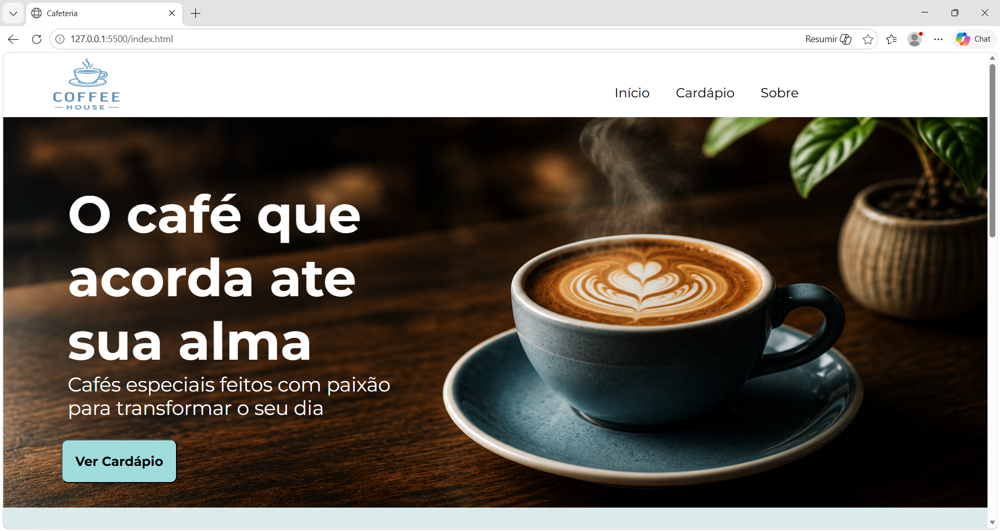

# ☕ Coffe House

Site de cafeteria desenvolvido com HTML, CSS, JAVASCRIPT focado em layout moderno, organização de componentes e experiência visual.

---

## 🚀 Demonstração
👉 Acesse o projeto: (https://meucoffehouse.netlify.app/)

---

## 📸 Preview do projeto

---

## 🛠️ Tecnologias utilizadas
- HTML5
- CSS3
- Git e GitHub
- Javascript

---

## 💡 O que foi praticado
- Estruturação de páginas web
- Organização de layout com CSS
- Uso de Git para versionamento
- Organização de projeto front-end

---

## 🎯 Objetivo
Criar um site simples, responsivo e com visual moderno para praticar desenvolvimento front-end.

---

## 📌 Status do projeto
✔️ Em evolução

---

## 👩‍💻 Desenvolvido por
Indra Lumiá
